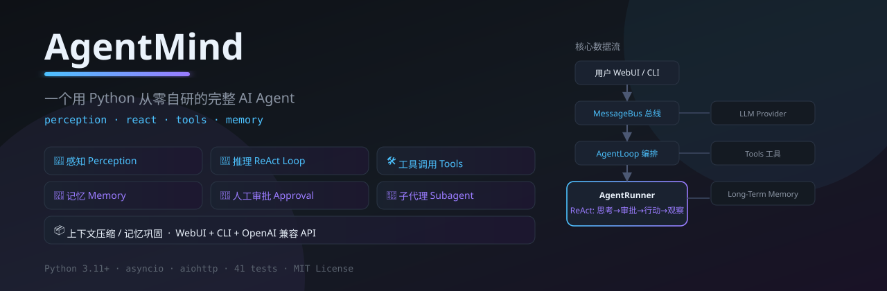

# AgentMind 🐈

<p align="center">
  
</p>

一个用 **Python + asyncio** 从零自研的、**完整可运行**的个人 AI Agent。

它不是为了包装一个 API，而是完整实现了成熟 Agent 的四大核心能力，并且每一条都能讲清楚"为什么这样设计"：

| 能力 | 含义 | 本项目实现 |
|---|---|---|
| 🧭 **感知 Perception** | 主动获取环境真实信息，而非凭空猜测 | 当前时间、文件系统、Shell、网络搜索/抓取、长期记忆检索，统一注入上下文 |
| 🔁 **推理 Reasoning** | ReAct 模式：思考 → 行动 → 观察 → 再思考 | `AgentRunner` 的 reason-act 循环，带工具轮数护栏 |
| 🛠️ **工具调用 Tool Calling** | 让模型决定何时调用哪个工具、传什么参数 | 工具注册表 + OpenAI function calling + 安全路径约束 |
| 🧠 **记忆 Memory** | 短期(会话内) + 长期(跨会话)两层记忆 | 会话历史(原子持久化) + SQLite 长期记忆(语义/关键词双模式检索) |

**进阶能力（成熟 Agent 的工程化标志）：**

| 能力 | 解决什么问题 | 本项目实现 |
|---|---|---|
| 🔐 **人工审批 Human-in-the-loop** | 危险工具(写文件/Shell)不能无声执行 | `core/permissions.py` 审批门控 + WebUI 审批弹窗，超时/拒绝即中止 |
| 👥 **子代理委派 Subagent** | 复杂任务要"拆分"，而不是塞爆父上下文 | `core/subagent.py` 隔离上下文 + `delegate` 工具 + 深度/并发护栏 |
| 📦 **上下文压缩/巩固 Consolidation** | 记忆不能只靠"裁剪丢弃"，要"压缩保鲜" | `core/compressor.py` LLM 摘要替代旧消息 + `core/consolidator.py` 长期记忆批量归纳 |
| 🌐 **多引擎搜索 Web Search** | 单一搜索引擎被墙/限流就废了 | `tools/web.py` 多 Provider（Bing RSS 默认，国内可用）自动降级 |
| 🛡️ **SSRF 网络防护** | 抓取工具不能被利用打内网/云元数据 | `security/network.py` 私有网段拦截 + 每跳重定向校验 |
| 🗂️ **工作区作用域 Workspace Scope** | 权限要能按会话收紧/放开 | `security/workspace_access.py` restricted/full 模式 + 每会话覆盖 |

- **技术栈**：Python 3.11+ · asyncio · aiohttp · pydantic（仅 3 个运行时依赖）
- **模型**：任何 OpenAI 兼容接口（OpenAI / DeepSeek / Ollama / vLLM / Kimi...），直接走 HTTP 协议实现，不依赖 SDK
- **交互**：Web 聊天界面（流式输出 + 工具调用可视化）+ 终端 CLI + OpenAI 兼容 HTTP API
- **License**：MIT

---

## 架构总览

```
┌─────────────┐    ┌─────────────────── 消息总线 MessageBus ───────────────────┐
│   Web 聊天    │───▶│ Inbound 队列     审批响应 ◀──────────────────────────────│
│ (WebSocket)  │    └──────────────┬───────────────────────────────────────────┘
│              │                   │
│  CLI / HTTP  │                   ▼
└─────────────┘            ┌───────────────────────────────┐
                           │        AgentLoop (编排)        │
                           │   · 会话级并发锁                │
                           │   · 短期记忆压缩(Compressor)    │
                           │   · 长期记忆巩固(Consolidator)  │
                           └──────────────┬────────────────┘
                                          ▼
                     ┌─────────────────────────────────────────┐
                     │       AgentRunner (ReAct 核心循环)        │
                     │                                          │
                     │  perceive: 上下文 = 系统提示词(含感知信息) │
                     │             + 短期记忆 + 长期记忆检索      │
                     │  reason:   流式请求 LLM                  │
                     │  act:      [审批门控 ApprovalGate]        │
                     │             └→ 执行工具并回填观察结果     │
                     │  loop:     直到模型给出最终答案(带轮数护栏) │
                     └──────┬──────────────┬──────────┬─────────┘
                            ▼              ▼          ▼
                   ┌──────────────┐  ┌──────────┐  ┌──────────────┐
                   │ LLM Provider │  │  Tool     │  │  Long-Term   │
                   │ (HTTP/OpenAI)│  │ Registry  │  │  Memory      │
                   └──────────────┘  └────┬─────┘  │  (SQLite +   │
                                          │         │   embedding) │
                    工具: 时间/文件/Shell/  │         └──────┬───────┘
                          网络/记忆/子代理  │           巩固归纳 Consolidator
                                        ▼
                            工具执行结果回填给模型
```

**核心数据流**：用户消息经 WebSocket 进入总线 → `AgentLoop` 消费并加会话锁 → `AgentRunner` 完成一轮 ReAct（感知上下文 → 流式推理 → 执行工具 → 观察结果）→ 结果持久化为短期记忆 → 自动巩固为长期记忆 → 事件经总线流式回传界面。

---

## 快速开始

### 1. 安装

```bash
uv sync --extra dev      # 或 python -m pip install -e .
```

### 2. 配置模型

支持三种方式（优先级：环境变量 > 配置文件 > 默认值）：

```bash
# 方式 A：环境变量（推荐）
export AGENTMIND_API_KEY=sk-xxx
export AGENTMIND_API_BASE=https://api.deepseek.com/v1   # 默认 OpenAI
export AGENTMIND_MODEL=deepseek-chat
```

```jsonc
// 方式 B：data/config.json
{
  "api_base": "http://localhost:11434/v1",
  "model": "qwen2.5",
  "api_key": "",
  // 人工审批：auto | ask_risky(默认) | ask_all
  "approval_mode": "ask_risky",
  // 子代理
  "max_subagent_depth": 2,
  "max_concurrent_subagents": 4,
  // 搜索：bing(默认,无需key) | duckduckgo | bocha | volcengine | tavily | brave | serper
  "search_provider": "bing",
  "search_api_key": "",
  // 权限：workspace 作用域
  "workspace_access": "restricted",   // restricted | full
  // 安全
  "network_allow_loopback": false,    // 允许抓取内网(SSRF风险)
  "web_token": ""                     // 设置后 WebUI 需 ?token=xxx
}
```

> 没有 key 也能跑：本地 Ollama / vLLM / LM Studio 都提供 OpenAI 兼容接口，`api_key` 留空即可。
> 想本地跑演示又没模型？见下方「零依赖离线演示」。

### 3. 启动

```bash
uv run agentmind                      # 启动 Web 界面 → http://127.0.0.1:8765
uv run agentmind chat                 # 终端聊天
uv run agentmind --port 9000          # 自定义端口
```

### 4. 试试这些（面试演示脚本）

| 想展示的能力 | 输入示例 |
|---|---|
| 感知-时间 | `现在几点了？`（模型会先调 `get_current_time` 再回答，不编造） |
| 工具调用-文件 | `在 workspace 里写一个 hello.txt，内容是"你好 AgentMind"，再读出来给我看` |
| 工具调用-网络 | `帮我搜索 python asyncio 的入门教程`（需联网） |
| 记忆-显式 | `记住：我喜欢简洁的回答，回复用中文` 然后换会话问 `我喜欢什么样的回答风格？` |
| 记忆-隐式 | 会话 A 里聊过的内容，在新会话里问 `我之前说过什么？`（触发长期记忆检索） |
| ReAct 多步 | `搜索 AgentMind 这个名字的含义`（模型会调工具→观察→再回答） |
| 跨会话长期记忆 | 隔天再开新会话问 `你记得我吗？` |
| 🔐 工具审批 | `帮我在 workspace 里创建 config.json，写入一份项目配置`（触发审批弹窗，演示拒绝后模型如何应对） |
| 👥 子代理委派 | `用子代理独立调研一下"ReAct 和 Chain-of-Thought 的区别"，把结论汇报给我`（子代理卡片独立运行） |
| 🌐 网页搜索 | `搜索 python asyncio 的官方文档地址`（Bing 多引擎自动降级，无需 key） |
| 🛡️ SSRF 防护 | 让 agent `抓取 http://127.0.0.1:8765/api/sessions`（会被拦截并如实说明） |

---

## 项目结构

```
agentmind/
├── bus/queue.py          # 异步消息总线（界面与核心解耦）
├── config.py             # pydantic 配置（环境变量/文件/默认三层）
├── runtime.py            # 运行时组装工厂（把所有子系统接线）
├── core/
│   ├── loop.py           # AgentLoop：编排、会话锁、记忆巩固
│   ├── runner.py         # AgentRunner：ReAct 循环（本项目的心脏）
│   ├── context.py        # 系统提示词构建 = 感知信息注入点
│   ├── permissions.py    # 🔐 人工审批：策略 + 门控 + 审批管理器
│   ├── subagent.py       # 👥 子代理：隔离上下文 + 深度/并发护栏
│   ├── compressor.py     # 📦 短期记忆压缩（LLM 摘要替代旧消息）
│   └── consolidator.py   # 📦 长期记忆巩固（episode 批量归纳）
├── providers/
│   ├── base.py           # LLMProvider 抽象（流式 + embedding）
│   └── openai_compat.py  # OpenAI 兼容 HTTP 客户端（无 SDK）
├── tools/
│   ├── base.py           # Tool 抽象（名称/描述/JSON Schema）
│   ├── registry.py       # 工具注册与安全执行
│   ├── context.py        # 每轮请求上下文（工具访问 emit 通道）
│   ├── datetime_tool.py  # 时间感知
│   ├── filesystem.py     # 文件读写（工作区路径约束）
│   ├── shell.py          # Shell 执行（默认关闭 + 危险命令拦截）
│   ├── web.py            # 网页搜索/抓取（无需 API key）
│   ├── memory_tool.py    # remember / recall 主动记忆工具
│   └── delegate_tool.py  # 👥 delegate：委派子代理
├── memory/
│   ├── store.py          # SQLite 记忆存储（异步安全）
│   ├── embeddings.py     # embedding 抽象
│   └── long_term.py      # 语义/关键词双模式检索
├── security/
│   ├── network.py        # 🛡️ SSRF 防护：私有网段拦截 + 重定向校验
│   └── workspace_access.py # 🗂️ workspace 作用域(restricted/full) + contextvar 绑定
├── session/
│   ├── types.py          # Message / Session 模型（含压缩游标）
│   └── manager.py        # 会话持久化 + 上下文裁剪
├── api/server.py         # WebSocket + REST + OpenAI 兼容端点 + 审批路由
├── webui/                # 聊天前端（原生 JS，含审批弹窗/子代理卡片）
└── cli.py                # 命令行入口
```

---

## 设计亮点（面试讲这些）

### 1. 感知与 ReAct 是一体的
系统提示词不是静态的——每轮都会注入当前时间、检索到的长期记忆、可用工具清单（`core/context.py`）。模型始终基于**真实感知**推理。提示词里明确要求"需要实时信息时先调工具，绝不编造"。

### 2. 工具是安全的第一公民
- 文件工具做了**路径约束**：任何路径都解析后校验必须位于 workspace 内，`../../` 越界直接拒绝（`tools/filesystem.py`）。
- Shell 工具**默认关闭**（`allow_shell=false`），开启后仍拦截 `rm -rf` 等破坏性命令。
- 工具执行异常会被捕获并以结构化结果回填给模型，模型能据此自救或如实说明。

### 3. 记忆是真·两层
- **短期**：会话历史带字符预算的上下文裁剪（`Session.context_window`），原子写入持久化。
- **长期**：每轮对话自动巩固为"episode"存入 SQLite；有 embedding 模型走余弦相似度语义检索，没有则退化为**CJK 感知的关键词评分**（中文 bigram 分词），保证离线也能回忆。

### 4. 并发与隔离
不同会话并行处理，同一会话消息按锁串行（`AgentLoop._lock_for`），避免上下文交错。界面与核心通过消息总线解耦，任何一端替换都不影响另一端。

### 5. 人工审批——安全是设计出来，不是补救出来的
`approval_mode` 三档：`auto` / `ask_risky`（默认，写文件+Shell 需审批）/ `ask_all`。审批走 `ApprovalManager` 的异步状态机——**响应先到或后到都正确**，超时视为拒绝（安全默认值）。被拒绝时模型会收到"用户拒绝了该工具调用"并如实调整，而不是假装执行了。子代理继承审批策略，但父代理批准了委派才轮到它。

### 6. 子代理——用隔离对抗上下文膨胀
子代理跑在**全新上下文**里（没有父对话历史），有自己的子代理系统提示词和工具权限，父上下文只收回一个浓缩结果。用 contextvar 追踪委派深度（`max_subagent_depth=2`）防止无限递归，用信号量限制并发（`max_concurrent_subagents=4`）。WebUI 上以独立卡片展示子代理任务与结果。

### 7. 记忆压缩与巩固——不只存储，还"整理"
- **短期压缩**：历史超预算时，不再丢弃旧消息，而是让 LLM 把最旧的一批压成一段摘要消息（`Compressor`，带压缩游标 `last_compacted` 避免重复压缩）。
- **长期巩固**：episode 记忆积累到 `consolidation_batch` 条后，批量归纳成更高层的 `summary` 记忆并删除原始条目（`MemoryConsolidator`），记忆库因此"越用越有条理"而不是无限膨胀。

### 8. 搜索多引擎 + SSRF 防护——能感知世界，且不被世界反噬
- **搜索**：借鉴 nanobot 的多 Provider 架构。默认 Bing RSS（无需 key、国内可用），自动降级链 `配置引擎 → bing → duckduckgo → 有 key 的引擎(博查/火山/Tavily/Brave/Serper)`。单一引擎被墙/限流不会让功能失效。
- **抓取**：`fetch_webpage` 带完整 SSRF 防护——每次请求和每次重定向都校验目标 IP，拒绝 RFC1918/环回/链路本地/云元数据网段；`network_allow_loopback` 显式开启才能抓内网。

### 9. 工作区作用域——权限按会话收紧/放开
每会话一个 `access_mode`：`restricted`（默认，工具只能碰 workspace）或 `full`（危险，可读写全盘）。作用域经 contextvar 在每轮绑定，文件系统工具据此决定自己的沙箱边界，WebUI 右上角可即时切换。

### 10. Web token——网关级访问控制
设置 `web_token` 后，WebUI 与所有 API 都要求 `?token=xxx`，静态壳页公开、数据通道(WS/API)强制鉴权，防止局域网内被他人操作你的 Agent。

### 11. 全链路可测试
62 个测试覆盖记忆检索、路径安全、ReAct 循环护栏、审批状态机（先到/后到/超时）、子代理深度护栏、压缩与巩固、SSRF 拦截、搜索解析与降级、WebSocket 端到端（含 mock OpenAI 服务）。CI 一条命令跑通。

---

## 测试与代码质量

```bash
uv run pytest -q          # 62 个测试
uv run ruff check .       # 代码规范
```

---

## 零依赖离线演示（面试前必看）

面试现场可能没网、没 key。三种保底方案：

1. **本地 Ollama**（推荐）：装 Ollama → `ollama pull qwen2.5:7b` → 启动后 API 即 `http://localhost:11434/v1`。注意 Ollama 默认不提供 embedding，本项目会自动退化为关键词检索，记忆依然工作。
2. **配置任意 OpenAI 兼容服务**：DeepSeek / Moonshot / 硅基流动 等国内服务，`AGENTMIND_API_BASE` 指过去即可。
3. **先跑测试**：`uv run pytest -q` 全绿本身就是"我能写对代码"的证据。

---

## 常见问题

**Q: 为什么要自己写 HTTP 客户端而不是用 openai SDK？**
为了让每一行网络逻辑都透明可控，也为了更小的依赖面（整个项目运行时仅 aiohttp + pydantic）。同时它天然兼容所有 OpenAI 协议的服务。

**Q: 长期记忆没有 embedding 模型怎么办？**
`LongTermMemory.recall` 会检测 embedding 是否可用：不可用时使用 `_keyword_score` 做关键词+中文 bigram 匹配，检索照样工作，只是语义泛化能力弱一些。

**Q: 为什么用 SQLite 而不是向量数据库？**
对个人 Agent 的体量（数千条记忆），SQLite + 内存余弦计算完全够用且零运维。这体现了"按规模选技术"的工程判断——不是越重越好。

**Q: 危险工具怎么拦？**
四层：① 文件/Shell 默认有路径/命令约束；② `approval_mode`（`auto`/`ask_risky`/`ask_all`）决定哪些工具要人工审批，审批弹窗在 WebUI 直接点允许/拒绝，超时自动拒绝；③ Shell 工具本身默认 `allow_shell=false` 关闭；④ 工作区作用域（restricted/full）决定文件工具的沙箱边界。

**Q: 网页搜索怎么做到的？为什么之前失败？**
多引擎架构。之前只用了 DuckDuckGo，它在国内被墙（返回 202 挑战页）。现在默认走 Bing RSS（无需 key、国内可用），失败自动降级到 DDG/博查/火山/Tavily 等。国内无 key 也能直接搜。

**Q: 抓取网页安全吗？**
`fetch_webpage` 内置 SSRF 防护（`security/network.py`）：拒绝私网/环回/云元数据地址，每个重定向跳都重新校验，`network_allow_loopback` 关闭时抓 `127.0.0.1` 会被明确拦截。

**Q: 子代理会不会无限递归？**
不会。`SubagentManager` 用 contextvar 追踪委派深度，超过 `max_subagent_depth`（默认 2）直接返回"层级已达上限"错误，同时用信号量限制并发数。

**Q: 上下文超预算怎么办？**
先触发 `Compressor`：让 LLM 把最旧的一批消息压成摘要（带 `last_compacted` 游标，只压缩一次），而不是直接丢弃。如果连摘要都失败，才回退到原来的裁剪。

**Q: 代码参考？**
架构思想参考了开源项目 [nanobot](https://github.com/HKUDS/nanobot)（MIT License）：消息总线/Agent 循环/多引擎搜索/workspace 作用域/SSRF 防护的设计启发，但本项目代码为独立实现，依赖面更小、更聚焦。

---

## 路线图

- [x] 工具调用人工审批（WebUI 弹窗 + 超时拒绝）
- [x] 子代理委派（隔离上下文 + 深度护栏）
- [x] 上下文压缩 / 长期记忆巩固
- [ ] 工具调用 UI 上支持手动批准/拒绝的批量模式
- [ ] 长期记忆可视化编辑面板
- [ ] 多模型路由（按任务自动选择模型）
- [ ] 子代理后台异步执行 + 完成后通知

---

MIT License · 由我（你）自研，用于展示对 Agent 工程化能力的理解。
